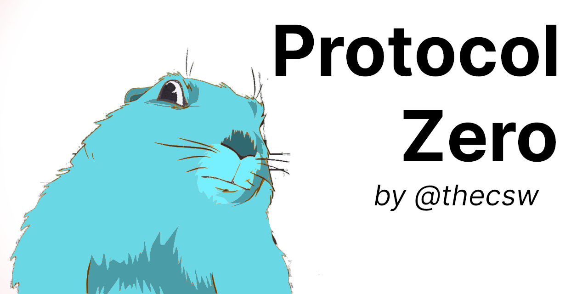

# Protocol Zero

## About

This is a quick tool to clear your online identities. Sometimes
deleting account is not enough as the service might just delete
your account but still retain all your messages with the OP's 
name hidden. This works partially but doesn't do you a lot of 
favor. 

*Protocol Zero* is used to delete the contents of your online 
accounts. This is more advantageous as you are still able to 
use your account afterwards. The tool *does not* delete accounts.

## Usage

The repo provides both a binary and a library of different services

Get the repo by

```sh
go get -u github.com/thecsw/ProtocolZero
```

Then you can run the program by simply invoking `ProtocolZero`

## Development

You can also use the program as a library. For example,
`github.com/thecsw/ProtocolZero/reddit` is a reddit package
that allows you to delete all your submissions and comments.

## Supported services

I wrote the first *Reddit* service for fun and it currently works
for cleanly deleting all your submissions and comments. Naturally,
we are looking at ability to delete all your messages from IMAP
mailboxes, clean Twitter feeds, etc. 

- [x] Reddit
- [ ] Email
- [ ] Twitter
- [ ] Facebook
- [ ] Instagram

## Demo

This is a quick prototype demo for Reddit. It's actually deleting my
reddit content here


## Contributing

Please feel free to contribute by adding new services or patching up 
existing ones!

## License

For any licensing questions, refer to [LICENSE](./LICENSE)
